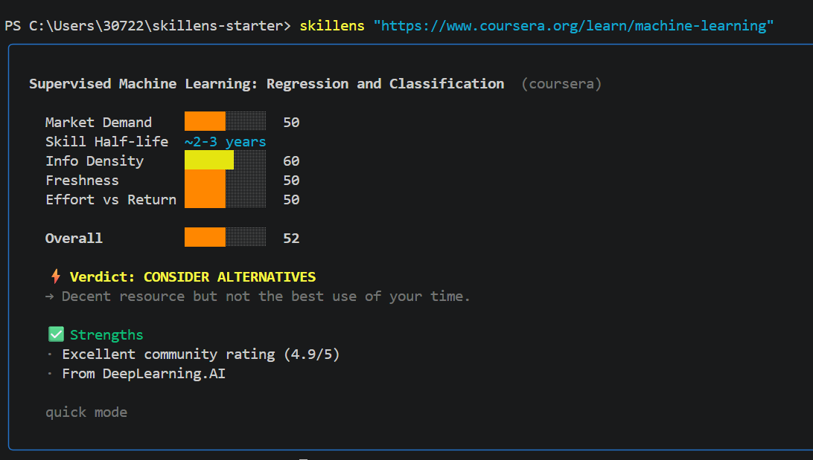

<div align="center">

# 🔍 SkiLens

### **这个值得学吗？** 在投入 40 小时之前先问一下。

一条命令，立刻给出结论：**学 · 不学 · 考虑更好的替代**。

[](https://pypi.org/project/skillens/)
[](https://pypi.org/project/skillens/)
[](LICENSE)
[](tests/)
[](https://github.com/YixiaJack/skillens/stargazers)

```bash
pip install skillens
skillens "https://www.coursera.org/learn/machine-learning"
```

[English](README.md) · **中文**



</div>

---

## 😤 痛点

你找到一门课，看起来不错。**40 小时之后**你才发现：

- 🕰️ 内容是三年前的，还停留在 Transformer 之前的时代
- 📉 它教的框架正在被自动化取代
- 📚 同样的内容,一个 2 小时的 YouTube 视频就讲完了
- 🎯 它和你真正要走的职业方向不匹配

> *"学习最难的部分从来不是学,而是决定学什么。"*

**SkiLens 在你投入之前就回答"这个该不该学？"**。贴一个 URL,3 秒出结论,还能顺便帮你找到更好的替代资源。

---

## ⚡ 30 秒演示

```bash
$ skillens "https://www.coursera.org/learn/machine-learning" --lang zh
```

```
╭──────────────────────── 🔍 SkiLens ─────────────────────────╮
│                                                              │
│   Machine Learning — Stanford (coursera)                     │
│   讲师: Andrew Ng · 更新: 2024-03 · 60h                       │
│                                                              │
│   市场需求       ████████░░  78    ↗ 上升中                   │
│   技能半衰期     ██████████  ~10y  ✦ 长青                     │
│   信息密度       ██████░░░░  62    → 一般                     │
│   内容新鲜度     █████░░░░░  48    ↘ 过时中                   │
│   投入产出比     ███████░░░  71    → 不错                     │
│                                                              │
│   综合评分       ███████░░░  68                              │
│                                                              │
│   ⚡ 结论: 值得学 (有保留)                                    │
│   → ML 基础是长青知识,但内容早于 Transformer 时代              │
│                                                              │
│   ✅ 优势                                                     │
│   · Andrew Ng 的教学非常出色                                   │
│   · 数学基础讲得扎实                                           │
│                                                              │
│   ⚠️  不足                                                    │
│   · 完全没有 LLM / Transformer 内容                           │
│   · TensorFlow 1.x 示例已经过时                               │
│                                                              │
│   💡 发现更好的替代                                           │
│                                                              │
│   1. Deep RL Course (Hugging Face)     82  +14 ↑            │
│      ├─ 更新 (2025),全程动手写代码                            │
│      └─ youtube.com/...                                      │
│                                                              │
│   2. Spinning Up in Deep RL (OpenAI)   79  +11 ↑            │
│      ├─ 信息密度高,免费                                       │
│      └─ github.com/openai/spinningup                         │
│                                                              │
╰──────────────────────────────────────────────────────────────╯
```

**零配置,不需要 API Key**。最关键的"发现更好的替代"功能开箱即用。

---

## 🚀 快速开始

```bash
# 1. 安装
pip install skillens

# 2. 指向任何资源
skillens "https://..."

# 3. 没有第三步
```

SkiLens 会自动识别平台并抓取对应的元数据。不需要任何参数,不需要任何配置。

---

## 🎯 评估哪些维度

| 维度 | 衡量什么 | 怎么算 |
|---|---|---|
| **市场需求** | 这个技能在招聘市场上还热吗? | 内置的技能需求数据集 + 热度代理指标 |
| **技能半衰期** | 这些知识多久会过时? | 主题分类(基础 / 成熟框架 / 快速迭代) |
| **信息密度** | 每小时投入能拿到多少干货? | 大纲分析、独立主题占比 |
| **内容新鲜度** | 内容是否跟得上当下? | 发布 / 更新时间,检测已废弃的技术 |
| **投入产出比** | 花这么多时间值不值? | 时长 × 需求的交叉权衡 |
| **个人匹配度** *(可选)* | 跟你的背景有多契合? | 基于你的技能 / 目标岗位的 token 重合度 |

每个维度合成一个 **0–100 的综合评分**,最终映射到三种结论之一: `学`、`不学`、`考虑更好的替代`。

---

## 🌐 支持各种来源

```bash
# URL — 自动识别平台
skillens "https://www.coursera.org/learn/machine-learning"
skillens "https://youtube.com/watch?v=..."
skillens "https://github.com/openai/gym"
skillens "https://arxiv.org/abs/2301.00001"
skillens "https://any-blog-or-tutorial.com/..."

# 技能 / 话题 — 通过网络搜索做市场分析
skillens topic "reinforcement learning"
skillens topic "rust programming"

# 两个资源并排对比
skillens "https://courseA" --compare "https://courseB"

# 输出 JSON 方便脚本处理
skillens "https://..." --json | jq .verdict
```

### 支持的平台

| 平台 | 状态 | 抓取的信息 |
|---|---|---|
| 🎓 **Coursera** | ✅ | 大纲、评分、选课人数、讲师、学校(基于 JSON-LD) |
| 📺 **YouTube** | ✅ | 标题、播放量、时长、简介、标签(基于 yt-dlp) |
| 💻 **GitHub** | ✅ | star 数、活跃度、话题标签、README、语言 |
| 📄 **arXiv** | ✅ | 摘要、作者、分类、日期 |
| 🌍 **普通网页** | ✅ | 回退到 Open Graph / JSON-LD / meta 标签 |
| 🎨 **插件** | ✅ | 通过 entry points 注册的第三方 provider,详见下文 |

---

## 🧠 深度模式 (可选 LLM)

默认的快速模式零配置就能用。如果想要更细腻的分析,可以接入任意 LLM:

```bash
# OpenAI (默认)
skillens config set llm openai
skillens config set api-key sk-...
skillens "https://..." --deep

# Anthropic Claude
skillens config set llm anthropic
skillens config set api-key sk-ant-...

# 本地 Ollama (100% 本地,$0)
skillens config set llm ollama
skillens config set model llama3.2
```

三种后端全部使用 **结构化输出** (OpenAI tool-calling、Anthropic `tool_use`、Ollama JSON schema),LLM 无法跑偏,所有评分都会通过 Pydantic schema 验证。

LLM 调用失败时会自动回退到快速模式,所以 `--deep` 永远是安全选项。

---

## 👤 个性化

只需要告诉 SkiLens 你是谁,之后每一次评估都会多出一个"个人匹配度"分数:

```bash
skillens profile set --skills "python,pytorch,rl,robotics" \
                     --role "ML engineer" \
                     --years 5
```

```
市场需求          ████████░░  78
内容新鲜度        █████░░░░░  48
个人匹配度        █████████░  85   ← 新增: 和你的技术栈高度契合
```

匹配器在 [`skillens/profile/matcher.py`](skillens/profile/matcher.py),纯 Python 实现,不需要 LLM。最佳区间是 **10–15% 的 token 重合度** (既不陌生也不完全重复);重合度过高会被扣分,理由是"你已经会了"。

---

## 🔌 插件生态

给任何平台加一个 provider,不需要 fork SkiLens。第三方包通过 entry points 注册即可:

```toml
# your-package/pyproject.toml
[project.entry-points."skillens.providers"]
udemy = "my_package.udemy:UdemyProvider"
```

```python
# my_package/udemy.py
from skillens.providers.base import BaseProvider
from skillens.core.models import ResourceMeta, SourceType

class UdemyProvider(BaseProvider):
    @property
    def name(self) -> str:
        return "udemy"

    @staticmethod
    def can_handle(url: str) -> bool:
        return "udemy.com/course/" in url

    async def extract(self, url: str) -> ResourceMeta:
        # 抓取、解析、返回 ResourceMeta(...)
        ...
```

`pip install` 之后 SkiLens 会在运行时自动发现。坏掉的插件只会静默失败并在 stderr 打一条警告,不会让 CLI 崩溃。

---

## 🤖 MCP 服务器模式

把 SkiLens 作为工具接入 **Claude Desktop**、**Cursor** 或任何 MCP 客户端:

```bash
pip install "skillens[mcp]"
skillens mcp   # 默认走 stdio
```

暴露三个工具: `evaluate_url(url)`、`analyze_topic(skill)`、`get_profile()`。把下面这段加到 Claude Desktop 的配置里:

```json
{
  "mcpServers": {
    "skillens": { "command": "skillens", "args": ["mcp"] }
  }
}
```

之后你的 Agent 就可以在对话中随手问一句 *"这门课值得学吗?"*,直接拿到一个结构化的结论。

---

## 🌏 多语言

```bash
skillens "https://bilibili.com/video/BV1..." --lang zh
```

目前支持 `en` 和 `zh`。当 `--lang auto` 时,遇到 `.bilibili.com` / `.zhihu.com` / `.cn` 等域名会自动切到中文输出。

---

## 🛠️ 架构

```
skillens/
├── cli.py               Typer CLI,支持裸 URL 直接传入
├── core/
│   ├── evaluator.py     流水线编排
│   ├── scorer.py        规则 + LLM 评分引擎
│   ├── dataset.py       内置技能需求数据集
│   ├── config.py        ~/.skillens/config.toml
│   └── models.py        Pydantic 数据模型
├── providers/           Coursera · YouTube · GitHub · arXiv · 网页 + 插件
├── llm/                 OpenAI · Anthropic · Ollama 后端 + 工厂
├── discovery/           ★ 通过 DDG 搜索发现替代资源
├── market/              技能 / 话题趋势分析
├── profile/             用户档案存储 + token 重合匹配
├── display/             Rich 面板 · JSON · 对比表 · i18n
├── mcp_server.py        暴露 evaluate_url / analyze_topic 的 FastMCP 服务器
└── data/
    └── skill_demand.json  2026.04 精选的关键词 → 需求映射
```

---

## 📦 安装选项

```bash
pip install skillens                    # 基础版 — 零配置,立刻能用
pip install "skillens[youtube]"         # 加 yt-dlp,YouTube 元数据更丰富
pip install "skillens[llm]"             # 加 openai + anthropic
pip install "skillens[discover]"        # 加 DuckDuckGo,启用替代发现
pip install "skillens[mcp]"             # 加 MCP 服务器支持
pip install "skillens[pdf]"             # 加 PyMuPDF,支持本地 PDF
pip install "skillens[all]"             # 全家桶
```

---

## 🧪 开发

```bash
git clone https://github.com/YixiaJack/skillens
cd skillens
python -m venv .venv && . .venv/Scripts/activate   # Windows
pip install -e ".[dev]"
pytest                                               # 67 个测试,~0.4 秒
```

通过率: **67 / 67** ✅ (当未安装可选的 `mcp` extra 时会跳过 1 个 MCP 测试,属于预期行为)。

---

## 🤝 贡献

最容易的贡献方式是 **新增一个 provider**。[插件生态](#-插件生态) 那一节给了完整模板——你甚至不需要 fork SkiLens,自己发一个带正确 entry point 的包就行。

也欢迎以下贡献:
- 在 [`display/i18n.py`](skillens/display/i18n.py) 增加新的语言包
- 在 [`data/skill_demand.json`](skillens/data/skill_demand.json) 更新技能需求数据
- 在 [`llm/`](skillens/llm/) 新增 LLM 后端

更多细节见 [CONTRIBUTING.md](CONTRIBUTING.md)。

---

## 🗺️ 路线图

- [x] 核心 CLI + 规则评分引擎
- [x] YouTube · Coursera · GitHub · arXiv · 网页 provider
- [x] Rich 终端输出,带评分条
- [x] JSON 输出模式
- [x] 替代资源发现 (★ 杀手级功能)
- [x] OpenAI / Anthropic / Ollama 深度模式
- [x] 用户档案 + 个人匹配评分
- [x] `--compare` 并排对比模式
- [x] 内置技能需求数据集
- [x] MCP 服务器模式
- [x] 中文输出 (`--lang zh`)
- [x] 基于 entry points 的 provider 插件系统
- [ ] VS Code 扩展封装
- [ ] 浏览器扩展 (边浏览边评估)
- [ ] Obsidian 插件接入
- [ ] 通过 GitHub Action 定时自动更新数据集

---

## 🧭 理念

> 在一个内容无限的世界,**瓶颈不在学习,而在筛选**。
>
> SkiLens 把评估从 *"40 小时之后"* 提前到 *"第一个小时之前"*。

项目永远不会违背的三条底线:

1. **5 秒出第一个结果。** 规则评分永远比 LLM 更快。
2. **基础使用零配置。** `pip install && skillens URL` 必须开箱即用。
3. **终端就是产品。** 不做 Web 面板,不做 SaaS,永远。

---

## 📄 许可证

MIT — 随便用。

---

<div align="center">

**如果 SkiLens 帮你避开了一门烂课,就给它一个 ⭐ 吧**

Built with 🔥 by [@YixiaJack](https://github.com/YixiaJack)

</div>
